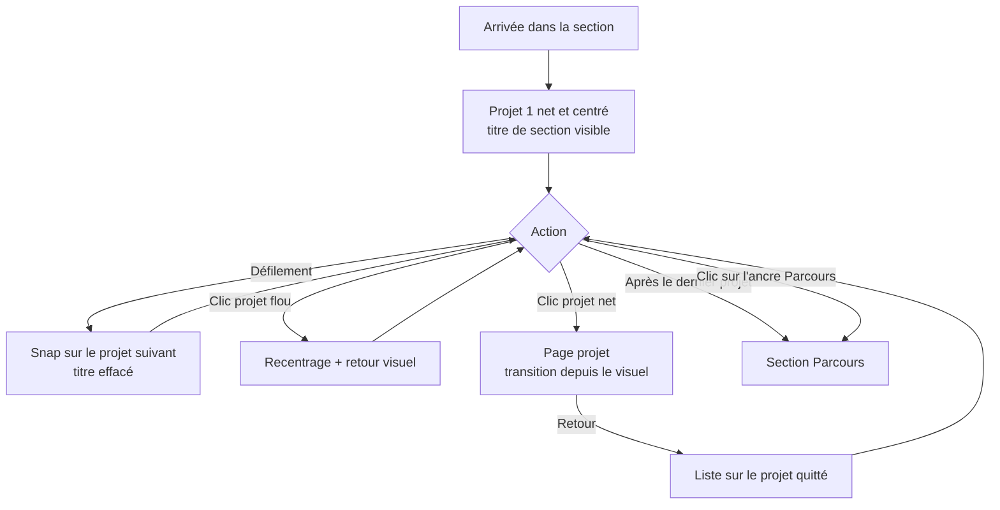

# Spec — Écran Projets

2026-09-20

## Contexte & persona

La section Projets est l'écran qui transforme un visiteur curieux en lecteur d'un projet. Le parti pris : montrer un seul projet à la fois, net et centré, les autres restant visibles mais flous. On échange de la densité contre de l'attention.

La section se comporte comme un écran complet : la liste défile à l'intérieur, le bas de l'écran ne bouge pas.

### Persona cible

Le recruteur ou le studio. Il regarde beaucoup de portfolios dans une même session, souvent en diagonale, souvent depuis un lien direct envoyé par un tiers, fréquemment sur mobile. Il accorde quelques secondes avant de décider s'il continue.

Trois conséquences de conception :

- L'arrivée par lien profond est un scénario principal, pas un cas limite.
- Le mobile est de première classe, pas un repli.
- Tout ce qui ralentit l'accès au premier projet est un coût, pas une signature.

### KPI

1. Taux d'ouverture d'une page projet — part des visites de la section qui débouchent sur l'ouverture d'au moins un projet. C'est la seule chose que cet écran fait réellement.
2. Nombre de projets vus par visite — combien de projets sont amenés au focus au cours d'une visite.

Tension assumée : le snap strict impose un projet à la fois et ralentit le parcours, ce qui sert le KPI 1 et freine le KPI 2. Avec 3 à 6 projets, un visiteur voit toute la liste en quelques molettes. Au-delà d'une dizaine, c'est le snap qu'il faudra assouplir (seuil documenté en fin de spec).

## Releases & user stories

Une seule release. L'écran ne tient debout que complet : une version sans flou ni snap n'est plus la même fonctionnalité, et livrer le desktop avant le mobile reviendrait à rater la cible principale la moitié du temps.

| # | User story | Criticité |
| --- | --- | --- |
| US1 | En tant que recruteur, quand je fais défiler la section, je veux qu'un seul projet soit net à la fois pour savoir lequel regarder sans arbitrer moi-même. | Critique |
| US2 | En tant que recruteur, quand un projet m'intéresse, je veux l'ouvrir d'un clic pour accéder à son détail. | Critique |
| US3 | En tant que recruteur, quand je reviens d'une page projet, je veux retrouver la liste là où je l'avais laissée pour continuer mon parcours sans me réorienter. | Critique |
| US4 | En tant que recruteur, quand j'arrive dans la section, je veux comprendre immédiatement ce que je regarde grâce au titre de section, qui s'efface dès que je commence à parcourir. | Normale |
| US5 | En tant que recruteur, quand j'ai fini de parcourir les projets, je veux continuer vers Parcours sans chercher comment sortir de la liste. | Normale |
| US6 | En tant que recruteur, quand on m'envoie le lien d'un projet précis, je veux arriver directement dessus. | Normale |
| US7 | En tant que recruteur sur une connexion lente, je veux que la liste reste lisible et stable pendant le chargement des visuels. | Normale |
| US8 | En tant qu'auteur du portfolio, je veux que chaque projet publié ait un visuel pour que la transition d'ouverture fonctionne toujours. | Normale |

## Critères d'acceptation

### US1 — Un seul projet net à la fois

- **ÉTANT DONNÉ** que je suis dans la section Projets, **QUAND** le défilement s'arrête, **ALORS** un projet exactement est net et centré verticalement dans la section, et tous les autres sont floutés.
- **ÉTANT DONNÉ** que je fais défiler la liste, **QUAND** je relâche la molette ou mon doigt, **ALORS** la liste se cale sur le projet le plus proche du centre et ne s'immobilise jamais entre deux projets.
- **ÉTANT DONNÉ** qu'un projet est net, **QUAND** je le regarde, **ALORS** son visuel s'anime en zoom lent, et les visuels des projets flous sont figés.
- **ÉTANT DONNÉ** que j'ai désactivé les animations dans mon système, **QUAND** je parcours la liste, **ALORS** le zoom est supprimé et le passage d'un projet à l'autre se fait sans transition animée, le flou restant en place.
- **ÉTANT DONNÉ** que je suis sur mobile, **QUAND** je parcours la liste, **ALORS** le comportement est identique au desktop : un projet net, snap strict, aucun mécanisme au survol.

### US2 — Ouvrir un projet

- **ÉTANT DONNÉ** qu'un projet est net, **QUAND** je clique dessus, **ALORS** sa page projet s'ouvre, son visuel de liste devenant le visuel d'ouverture de la page.
- **ÉTANT DONNÉ** qu'un projet est flou, **QUAND** je clique dessus, **ALORS** il est amené au centre et devient net, et la page ne s'ouvre pas.
- **ÉTANT DONNÉ** que je viens de cliquer un projet flou, **QUAND** il arrive au centre, **ALORS** un retour visuel immédiat confirme que le clic a été reçu, pour qu'il ne soit pas pris pour un clic raté.
- **ÉTANT DONNÉ** que la transition depuis le visuel n'est pas disponible dans mon navigateur, **QUAND** j'ouvre un projet, **ALORS** la page s'ouvre en fondu et l'accès au contenu est identique.
- **ÉTANT DONNÉ** que je navigue au clavier, **QUAND** j'appuie sur Tab, **ALORS** le projet suivant est amené au centre et devient net, et Entrée ouvre le projet net.

### US3 — Retour dans la liste

- **ÉTANT DONNÉ** que j'ai ouvert un projet, **QUAND** je reviens en arrière, **ALORS** la liste s'affiche avec ce projet net et centré, sans animation de réarrivée.
- **ÉTANT DONNÉ** que je reviens en arrière, **QUAND** la liste réapparaît, **ALORS** le titre de section reste effacé, puisque je ne suis pas en haut de la liste.
- **ÉTANT DONNÉ** que je reviens sur le dernier projet de la liste, **QUAND** je continue de faire défiler, **ALORS** je poursuis vers Parcours normalement.

## Designs & schéma de flux

### Anatomie d'une ligne projet

De gauche à droite : date, nom du projet (le plus gros élément typographique de la ligne), thème, visuel. Sur mobile, date, nom et thème s'empilent à gauche, le visuel reste à droite.

Le bas de l'écran est un dégradé fixe vers l'orange, portant le lien d'ancre vers Parcours. Il ne défile jamais avec la liste.

### Prototypes

| Prototype | Ce qu'il tranche |
| --- | --- |
| [Focus : snap vs survol](https://claude.ai/artifact/SZjgDD9uDE2AtzFnioapa7) | Comparaison des deux modèles de focus. Le modèle retenu est le scroll avec snap. |
| [Ouverture de la page projet](https://claude.ai/artifact/CPH9s4xRT74top5ChrXKrv) | Les trois transitions d'ouverture. Retenue : depuis le visuel. |
| [Visuel : mouvement & chargement](https://claude.ai/artifact/Q7Gu18AUeodVDueWpr1v85) | Type d'animation du visuel et stratégie de chargement. Retenus : zoom lent, flou progressif. |

Les prototypes simulent la page projet dans le même document. La transition depuis le visuel y est donc plus facile qu'en conditions réelles — voir la dépendance d'architecture en fin de spec.

### Flux principal

## Cas limites & erreurs

| Situation | Comportement attendu |
| --- | --- |
| Fenêtre trop courte pour une ligne entière | Le snap strict est désactivé sous une hauteur de fenêtre seuil ; la liste redevient librement défilable et le flou se calcule toujours par rapport au centre. Sans cela, une partie de la ligne devient inatteignable. |
| Un seul projet publié | Pas de flou, pas de snap : le projet est centré et la sortie vers Parcours reste disponible immédiatement. |
| Aucun projet publié | La section est retirée du défilement de la page et son ancre ne s'affiche pas. Jamais d'écran vide avec un message. |
| Projet sans visuel | Publication impossible : le visuel est obligatoire. Contrôle côté édition, pas d'affichage de secours côté public. |
| Visuel qui ne charge pas | Le flou du chargement progressif reste affiché indéfiniment plutôt que de laisser un trou ; la ligne reste cliquable et la page projet s'ouvre normalement, en fondu. |
| Connexion lente | Seul le visuel du projet net et celui du projet suivant sont chargés en priorité ; les autres attendent d'approcher du centre. |
| Nom de projet très long | Le nom passe sur deux lignes au maximum, puis est tronqué. La hauteur de la ligne ne change pas, sinon le snap devient imprévisible. |
| Ancre pointant sur un projet inexistant ou dépublié | Arrivée en tête de section, projet 1 net, sans message d'erreur. |
| Défilement très rapide | Le flou n'est pas recalculé à chaque image mais échantillonné ; aucun état intermédiaire ne doit rester figé quand le défilement s'arrête. |
| Tap suivant immédiatement un défilement sur mobile | Ignoré si le défilement était encore en cours, pour éviter les ouvertures accidentelles. |
| Double clic rapide sur un projet net | Une seule ouverture ; le second clic est absorbé pendant la transition. |
| Retour navigateur pendant la transition d'ouverture | La transition est interrompue et la liste réapparaît immédiatement sur le projet quitté. |
| Animations réduites activées | Zoom du visuel supprimé, transitions de focus et d'ouverture remplacées par des changements instantanés ou un fondu court. Le flou reste, c'est une information, pas une animation. |

## Décisions actées & points ouverts

### Actées

| Sujet | Décision |
| --- | --- |
| Modèle de focus | Défilement avec snap strict, un projet net à la fois, centré exactement. Identique desktop et mobile. |
| Projets non focalisés | Flou progressif selon la distance au centre. |
| Clic sur un projet flou | Recentrage au premier clic, ouverture au second. |
| Ouverture d'un projet | Page dédiée, transition partant du visuel de la liste. |
| Retour | Sur le projet quitté, net et centré. |
| Titre de section | Au-dessus du projet 1, disparaît en fondu au premier défilement. |
| Sortie de section | Défilement au-delà du dernier projet, ou clic sur l'ancre Parcours. Même comportement que l'ancre Projets de la page d'accueil. |
| Volume et ordre | 3 à 6 projets, ordre antéchronologique. |
| Visuel | Obligatoire, animé en zoom lent uniquement sur le projet net, chargé en flou progressif. |
| URL | Une ancre par projet. |
| Release | Une seule, desktop et mobile. |

### Points ouverts

1. **Architecture de navigation** — à trancher par le dév. Le comportement de référence est l'ouverture depuis le visuel ; le fondu est le repli accepté quand la transition n'est pas disponible. Le dév choisit le moyen, pas le résultat.
2. **Seuil de hauteur de fenêtre** sous lequel le snap strict se désactive — à fixer en intégration, sur la hauteur réelle d'une ligne.
3. **Seuil de volume** — au-delà d'une dizaine de projets, le snap strict entre en conflit avec le KPI « projets vus par visite » et devra être assoupli. À réévaluer à chaque ajout de projet.
4. **Forme du retour visuel** au premier clic sur un projet flou — à définir avec le design.
5. **Délai d'inhibition du tap** après un défilement sur mobile — à régler à l'usage.
