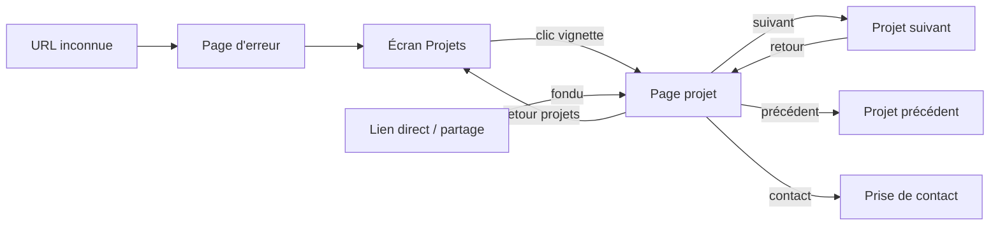

# Spec — Page projet (gabarit générique)

**Statut** : à designer · **Release** : unique (desktop + mobile) · **Dépend de** : spec écran Projets

---

## ⭐️ Contexte & persona

La page projet est la destination de l'écran Projets : c'est là que se joue la conversion. 

Cette spec définit un **gabarit générique** : tous les projets partagent la même structure, seul le contenu change. Aucun projet n'a de mise en page sur mesure.

**Persona** — Recruteur ou studio. Lit en diagonale, souvent sur mobile, arrive fréquemment par un lien direct (partagé, ou collé depuis un CV) sans être passé par l'écran Projets. Il cherche trois choses dans cet ordre : qu'est-ce que c'était, qu'est-ce que tu as fait toi, qu'est-ce que ça a donné.

**KPI**
- Primaire : prise de contact après consultation d'au moins une page projet.
- Secondaire : projets vus par visite (la navigation projet suivant / précédent est le levier direct).
- Proxy de lecture : atteinte du bloc **Result** (dernier bloc de contenu).

**Conséquence de la cible sur la structure** : le framework STAR place l'information la plus convaincante (Result) en fin de page. C'est assumé, mais cela impose deux garde-fous inscrits plus bas : un chapô en tête de page qui donne le résultat en une phrase, et un bloc Result qui doit être chiffré ou daté.

---

## 🧱 Le gabarit STAR

Ordre fixe, identique pour tous les projets, non réordonnable par le contenu.

| Zone | Contenu | Obligatoire |
|---|---|---|
| En-tête | Titre du projet, rôle tenu, client, année | Oui |
| Chapô | 1 à 2 phrases qui résument le projet **et son résultat** | Oui |
| **S — Situation** | Le contexte de départ, le problème, la contrainte | Oui |
| **T — Task** | L'objectif à atteindre et le périmètre confié | Oui |
| **A — Action** | Ce qui a été fait, personnellement. Méthode, décisions, arbitrages | Oui |
| **R — Result** | Ce que ça a produit, **chiffré ou daté** | Oui |
| Pied de page | Projet précédent · Projet suivant | Oui (si voisin existant) |

**Règles éditoriales**
- Les 4 blocs sont obligatoires : un projet auquel il manque un bloc n'est pas publiable.
- Result sans chiffre ni date est refusé. Une phrase qualitative attribuée (retour client, décision prise) est acceptée à défaut de métrique.
- Au moins un visuel par projet (cohérent avec la règle « visuel obligatoire » de l'écran Projets, la vignette étant réutilisable).
- Longueurs indicatives : chapô ≤ 40 mots, S et T ≤ 80 mots chacun, A ≤ 200 mots, R ≤ 100 mots. Indicatives, non bloquantes.

**Ce qui est laissé au designer**
Le placement, le nombre et le format des visuels sont libres : héros, intercalés, galerie, ou mélange. Le designer est libre de la mise en page tant que les invariants suivants tiennent :
1. l'ordre S → T → A → R est respecté visuellement ;
2. les 4 blocs sont distinguables les uns des autres (titre, séparateur ou traitement typographique) ;
3. le chapô est visible sans scroll sur mobile comme sur desktop ;
4. la navigation précédent / suivant est atteignable en fin de page ;
5. la page reste lisible avec un seul visuel, et avec dix.

---

## 👫 User stories

Une seule release, desktop et mobile simultanés.

- **US1** — En tant que recruteur, quand j'ouvre un projet, je veux comprendre le contexte, mon rôle et le résultat dans un ordre constant, pour évaluer vite sans réapprendre la mise en page à chaque projet.
- **US2** — En tant que recruteur, quand j'ai fini un projet, je veux passer au suivant sans repasser par la liste, pour en voir plusieurs dans la même visite.
- **US3** — En tant que recruteur arrivé par un lien direct, je veux comprendre où je suis et accéder au reste du site, pour ne pas rester bloqué sur une page orpheline.
- **US4** — En tant que recruteur, quand je reviens aux projets, je veux retrouver la liste sur le projet que je viens de quitter, pour reprendre où j'en étais.
- **US5** — En tant que recruteur convaincu, je veux pouvoir prendre contact depuis la page projet, sans chercher.
- **US6** — En tant que recruteur, je veux partager l'URL d'un projet précis à un collègue, pour qu'il arrive exactement dessus.
- **US7** — En tant qu'auteur du portfolio, je veux qu'un projet incomplet ne soit pas publiable, pour garantir l'homogénéité du gabarit.

---

## ✅ Critères d'acceptation

### US1 — Consulter un projet

- **GIVEN** j'ouvre une page projet
- **WHEN** la page s'affiche
- **THEN** l'en-tête, le chapô et le début du bloc Situation sont visibles, et les blocs se succèdent dans l'ordre Situation → Task → Action → Result.

- **GIVEN** je suis sur une page projet
- **WHEN** je scrolle jusqu'en bas
- **THEN** le dernier bloc de contenu est Result, suivi de la navigation précédent / suivant.

- **GIVEN** un visuel du projet n'a pas fini de charger
- **WHEN** la page s'affiche
- **THEN** son emplacement est réservé en flou progressif et le texte reste lisible et scrollable ; la mise en page ne saute pas à l'arrivée du visuel.

- **GIVEN** un visuel est définitivement indisponible
- **WHEN** la page s'affiche
- **THEN** son emplacement est retiré du flux, et aucun cadre vide ni icône d'erreur n'est affiché.

### US2 — Enchaîner au projet suivant

- **GIVEN** je suis en bas d'une page projet qui a un voisin de chaque côté
- **WHEN** j'atteins le pied de page
- **THEN** je vois deux entrées, « Projet précédent » et « Projet suivant », chacune nommée par le titre du projet visé, dans l'ordre antéchronologique de l'écran Projets.

- **GIVEN** je consulte le projet le plus récent (resp. le plus ancien)
- **WHEN** j'atteins le pied de page
- **THEN** l'entrée « précédent » (resp. « suivant ») n'est pas affichée, et un retour vers l'écran Projets occupe sa place.

- **GIVEN** il n'existe qu'un seul projet publié
- **WHEN** j'atteins le pied de page
- **THEN** aucune navigation précédent / suivant n'est affichée, seulement le retour aux projets.

- **GIVEN** je clique sur « Projet suivant »
- **WHEN** la nouvelle page s'affiche
- **THEN** je suis positionné en haut de cette page, l'URL a changé, et le bouton retour du navigateur me ramène au projet précédent en bas de page.

- **GIVEN** j'ai cliqué sur « Projet suivant »
- **WHEN** je clique à nouveau avant la fin de la transition
- **THEN** le second clic est ignoré et une seule navigation a lieu.

### US3 — Arrivée par lien direct

- **GIVEN** j'ouvre l'URL d'un projet sans être passé par l'écran Projets
- **WHEN** la page s'affiche
- **THEN** elle s'affiche en fondu (pas de transition depuis une vignette, celle-ci n'existant pas), et l'accès au reste du site est disponible.

- **GIVEN** j'ouvre l'URL d'un projet dépublié ou inexistant
- **WHEN** la page se charge
- **THEN** j'obtiens une page d'erreur explicite proposant un retour à l'écran Projets, et non une page projet vide.

- **GIVEN** je suis arrivé par lien direct
- **WHEN** je clique sur le retour aux projets
- **THEN** l'écran Projets s'ouvre centré sur le projet que je viens de quitter.

---

## 📱 Designs & diagramme

Pas de prototype à ce stade : les propositions visuelles sont à la main du designer, sur la base des invariants listés plus haut. Seule la logique de navigation est figée.

Retour depuis une page projet : l'écran Projets se rouvre sur le projet quitté, y compris après un enchaînement suivant / suivant — c'est le **dernier** projet consulté qui sert de point de retour, pas celui d'où l'on venait initialement.

---

## 🧀 Edge cases

| Cas | Comportement attendu |
|---|---|
| Projet sans visuel exploitable | Non publiable. La règle « au moins un visuel » est bloquante en amont. |
| Bloc STAR manquant | Non publiable. Le projet n'apparaît ni dans la liste ni à son URL. |
| Result sans chiffre ni date | Signalé à la publication comme avertissement, non bloquant. |
| Bloc Action très long | La page scrolle, rien n'est tronqué. Pas de « lire la suite ». |
| Projet unique publié | Pied de page réduit au retour aux projets. |
| Premier ou dernier projet | Un seul voisin affiché, l'autre emplacement devient le retour aux projets. |
| Ordre des projets modifié après partage d'un lien | L'URL reste valide : elle pointe le projet, jamais sa position. |
| Double clic ou clic répété sur suivant | Un seul changement de page. |
| Retour navigateur après enchaînement | Remonte l'historique projet par projet, position de scroll restaurée. |
| Fenêtre très courte (paysage mobile) | Le chapô reste visible sans scroll ; si impossible, il prime sur le visuel d'en-tête. |
| Connexion lente | Le texte s'affiche avant les visuels. La page est lisible sans eux. |
| Lecteur d'écran | Les 4 blocs sont des sections titrées, lues dans l'ordre S/T/A/R ; les visuels décoratifs sont ignorés, les visuels porteurs d'information ont un texte alternatif. |
| Impression / PDF | La page s'imprime dans l'ordre STAR, navigation exclue. |
| Projet sous NDA | Le gabarit ne prévoit aucun traitement spécifique : soit le contenu est reformulable sans le client, soit le projet n'est pas publié. |
